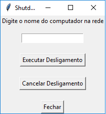

Bom criei esse projeto para ver até onde vai o Python, o programa é bem simples e foi feito unica e exclusivamente para o meu aprendizado. Leia as instruções com muita atenção pois você pode acabar desligando seu proprio computador. Peço que não usem esse programa para afetar alguem negativamente. Queria agradecer o grupo He4rt por terem me motivado a fazer meu primeiro projeto, por mais que pequeno. É isso.
Enjoy the App
App feito por PhboHe4rt
Prints do aplicativo:   Tela Inicial: ; Tela Secundaria: ; Tela de Desligamento:; Tela de Reinicialização:.
